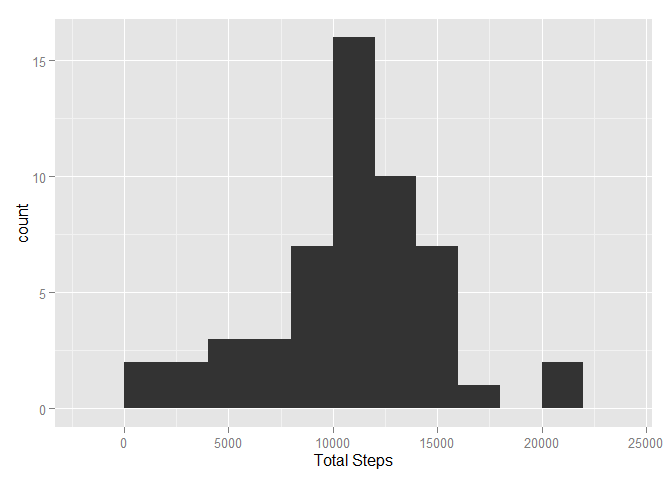
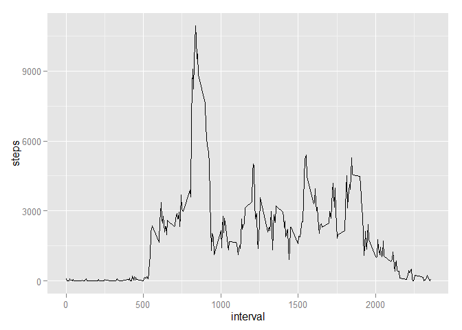
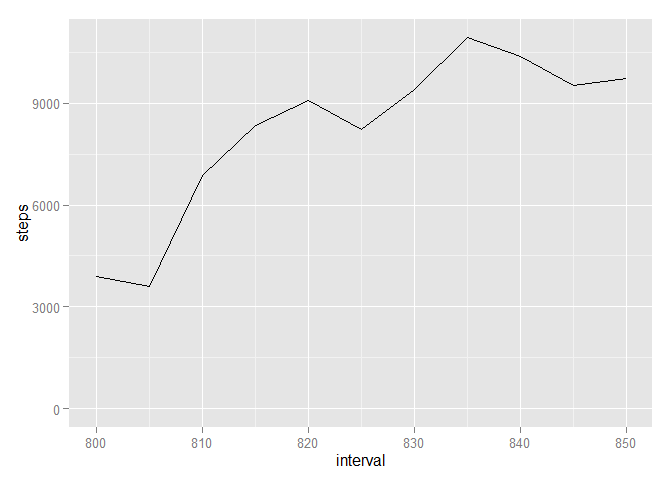
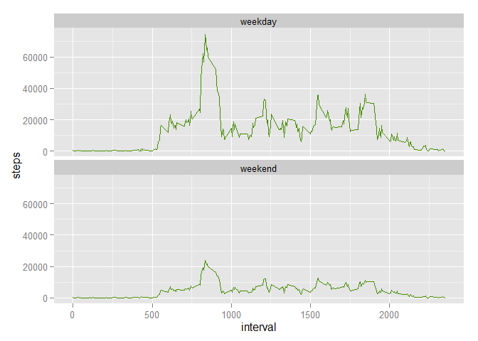

# Reproducible Research: Peer Assessment 1


## Loading and preprocessing the data

The data is unzipped, and the csv file inside is read  


```r
unzip("activity.zip")
activity <- read.csv("activity.csv")
head(activity)
```

```
##   steps       date interval
## 1    NA 2012-10-01        0
## 2    NA 2012-10-01        5
## 3    NA 2012-10-01       10
## 4    NA 2012-10-01       15
## 5    NA 2012-10-01       20
## 6    NA 2012-10-01       25
```

Format date column to be POSIXct:


```r
library(lubridate)

activity$date <- ymd(activity$date)
```

## What is mean total number of steps taken per day?
The dplyr package is loaded and used to group the activity data by day and then calculate the total number of steps (the sum) for each day; the result is saved as "tot_act".  This is sumarized through a histrogram plotted with ggplot2:


```r
library(dplyr)
tot_act <- activity %>% group_by(date) %>% summarise_each(funs(sum))
library(ggplot2)
qplot(steps, data = tot_act, binwidth = 2000) + xlab("Total Steps")
```

 

Mean and median of the total number of steps taken per day.  Missing values are ignored with "na.rm=TRUE":

```r
mn_act <- mean(tot_act$steps, na.rm=TRUE)
mdn_act <- median(tot_act$steps, na.rm=TRUE)

mn_act  #Mean total number of steps
```

```
## [1] 10766.19
```

```r
mdn_act #Median total number of steps
```

```
## [1] 10765
```


## What is the average daily activity pattern?
Make a time series plot (i.e. type = "l") of the 5-minute interval (x-axis) and the average number of steps taken, averaged across all days (y-axis)


```r
activity_nona <- activity[complete.cases(activity),]
interval_act <- activity_nona %>% group_by(interval) %>% summarise_each(funs(sum))
#head(interval_act)
qplot(interval,steps, data=interval_act, geom = "line")
```

 

These results show the average 5 min interval that contains the maximum number of steps is somewhere between 800 and 850.  To get a closer look, the same plot is made with a specified range for the x-axis:


```r
qplot(interval,steps, data=interval_act, geom = "line", xlim = c(800,850))
```

```
## Warning: Removed 277 rows containing missing values (geom_path).
```

 

This plot shows that the five minute interval with the most steps is 835.

## Imputing missing values

Count the number of NAs in the original data frame "activity":


```r
sum(is.na(activity))
```

```
## [1] 2304
```

Note that the total number of missing values are all in the steps column:


```r
summary(activity)
```

```
##      steps             date               interval     
##  Min.   :  0.00   Min.   :2012-10-01   Min.   :   0.0  
##  1st Qu.:  0.00   1st Qu.:2012-10-16   1st Qu.: 588.8  
##  Median :  0.00   Median :2012-10-31   Median :1177.5  
##  Mean   : 37.38   Mean   :2012-10-31   Mean   :1177.5  
##  3rd Qu.: 12.00   3rd Qu.:2012-11-15   3rd Qu.:1766.2  
##  Max.   :806.00   Max.   :2012-11-30   Max.   :2355.0  
##  NA's   :2304
```

All missing values for number of steps will be filled with the mean values corresponding to that interval.  The average number of steps for each interval was stored above in a data frame "interval_act".

A new data frame, "activity_merged" is made where interval_act is merged by the interval key with the original "activity" data frame.  The missing values in the original steps column (which is called steps.x after the merge) will be filled with the new values from "interval_act" (this column is just called "steps" after the merge)


```r
activity_merged <- merge(activity, interval_act, by = "interval")
head(activity_merged)
```

```
##   interval steps.x     date.x steps.y     date.y
## 1        0      NA 2012-10-01      91 4240-01-18
## 2        0       0 2012-11-23      91 4240-01-18
## 3        0       0 2012-10-28      91 4240-01-18
## 4        0       0 2012-11-06      91 4240-01-18
## 5        0       0 2012-11-24      91 4240-01-18
## 6        0       0 2012-11-15      91 4240-01-18
```

```r
nas <- is.na(activity_merged$steps.x)


activity_merged$steps.x[nas] <- activity_merged$steps.y[nas]
head(activity_merged)
```

```
##   interval steps.x     date.x steps.y     date.y
## 1        0      91 2012-10-01      91 4240-01-18
## 2        0       0 2012-11-23      91 4240-01-18
## 3        0       0 2012-10-28      91 4240-01-18
## 4        0       0 2012-11-06      91 4240-01-18
## 5        0       0 2012-11-24      91 4240-01-18
## 6        0       0 2012-11-15      91 4240-01-18
```

Now, the merged data frame is grouped by date, then mean number of steps each day is calculated:

```r
tot_act_imputed <- activity_merged[,c("interval", "steps.x", "date.x")] %>% group_by(date.x) %>% summarise_each(funs(sum))
```


The last step is to recalculate the new mean and median:

```r
mn_act_imputed <- mean(tot_act_imputed$steps.x)
mdn_act_imputed <- median(tot_act_imputed$steps.x)

mn_act_imputed  #Mean total number of steps after missing values imputed
```

```
## [1] 84188.07
```

```r
mdn_act_imputed #Median total number of steps after missing values imputed
```

```
## [1] 11458
```

```r
mn_act - mn_act_imputed # difference between mean with missing values and imputed values
```

```
## [1] -73421.88
```

```r
mdn_act -  mdn_act_imputed # difference between median with missing values and imputed values
```

```
## [1] -693
```


## Are there differences in activity patterns between weekdays and weekends?

First, the current activity_merged data frame is cleaned up to only contain the first three columns.

A new column is added to give the day of the week each date entry corresponds to.

wkday is a data frame filtered for only Monday - Friday data entries

wkend is a data frame filtered for entries only on Saturday and Sunday


```r
activity_merged <- activity_merged[,c("interval", "steps.x", "date.x")]

activity_merged <- mutate(activity_merged, day = weekdays(date.x))

wkday <- filter(activity_merged, day %in% c("Monday", "Tuesday", "Wednesday", "Thursday", "Friday"))

wkend <- filter(activity_merged, day %in% c("Saturday", "Sunday"))

wkday <- wkday %>% group_by(interval) %>% summarise(steps = sum(steps.x)) %>% mutate(part_of_week = "weekday")
wkend <- wkend %>% group_by(interval) %>% summarise(steps = sum(steps.x)) %>% mutate(part_of_week = "weekend")

week <- rbind(wkday, wkend)

ggplot(week, aes(interval, steps))+geom_line(color="chartreuse4")+ facet_wrap(~part_of_week, ncol=1)
```

 
